<!DOCTYPE html>
<html lang="en">
<head>
    <meta charset="UTF-8">
    <meta name="viewport" content="width=device-width, initial-scale=1.0">
    <title></title>
</head>
<body style="background-color: antiquewhite;">
    <nav style="background-color:skyblue;">
    <table><tr><td><b>Skye Blue Interior Design </b>  -Navadeep Sai
    

Menu
<ul style="text-align: right;">
    <a href="#home"><li>Home</li></a>
    <a href="#aboutus"><li>About us</li></a>
    <a href="#service"><li>Services</li></a>
    <a href="#contact"><li>Contact</li></a></ul>
</td></tr></table> 
</nav> 
    

    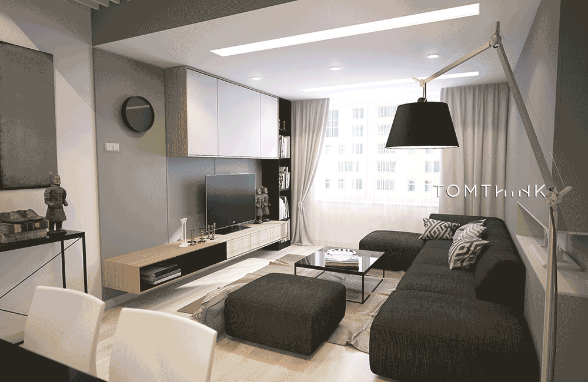
<section id="home">
    <h1 style="font-size: 80px;text-align: center;">Loooking for Expert   Interior Designer ?</h1>
    
Transform your home, office and Commercial  space into a masterpiece with our expert  Interior designing Services in Hyd.

    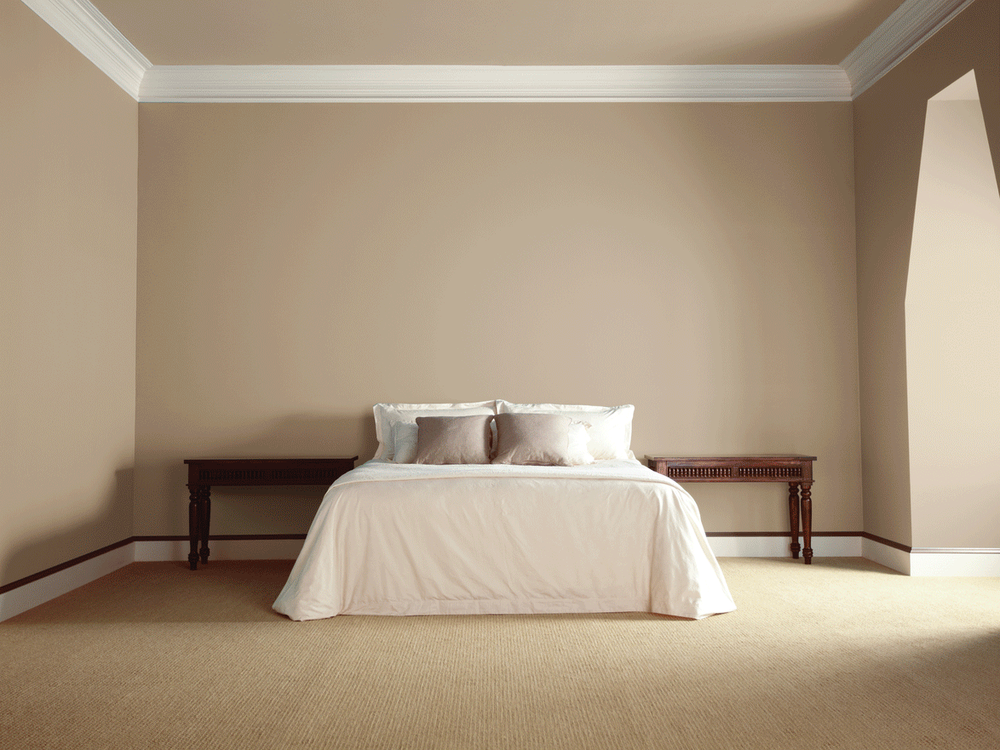
</section>
<section id="aboutus">
    <h1 style="font-size: 80px; text-align: center;">Best Interior Design Serivces in Hyd</h1>
    <h3 style="font-size: 50px; color: slategrey; text-align: center;"> Designing with trust, Building with belief.</h3>
    
<b>Vision: </b>To bring in the latest tactics of Infrastructure management, and successfully implementit.
    To be one of the Best Interior Design Serivce in Hyd for corporate buildings, commercial complexes and residential houses globally. 

    
<b>Mission: </b> Providing the best value Serivce to our customer. 
    Working hard tirelessly in order to ensure that our clients get the finest service in the domain of retail interior designing.
    To be transparent and authenic at all times with our esteemed customers, this in turn helps build loyalty. 

    <h1 style="font-size: 80px; text-align: center;">Our Projects</h1>
    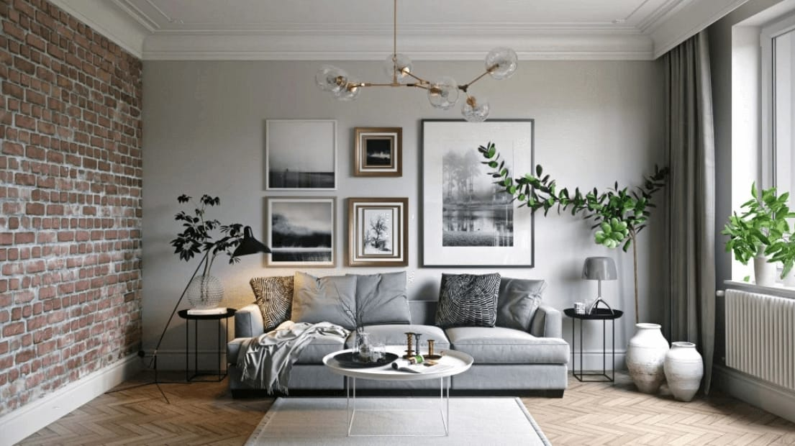   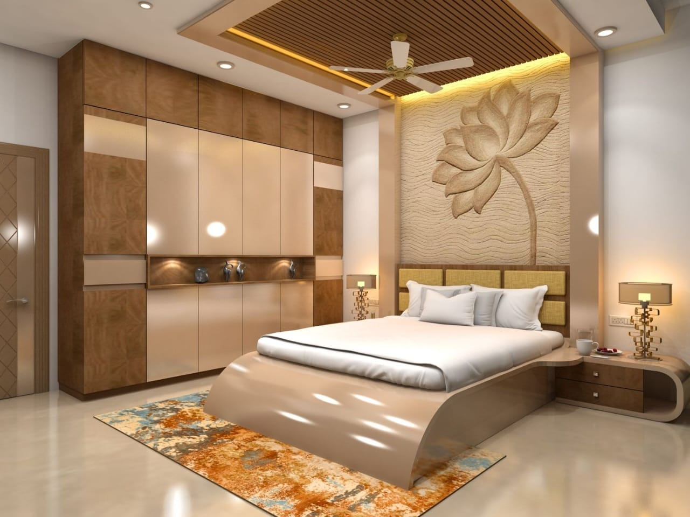   
    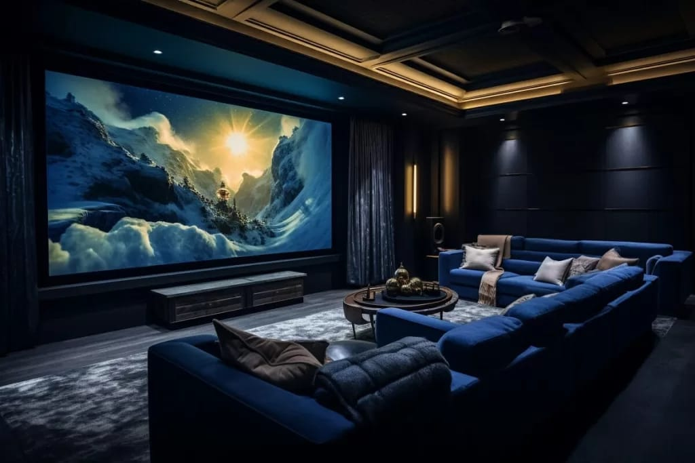   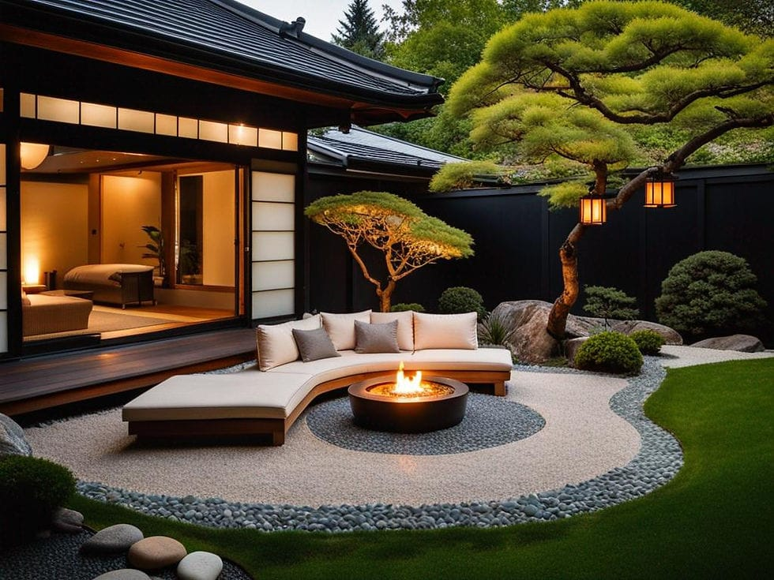   
    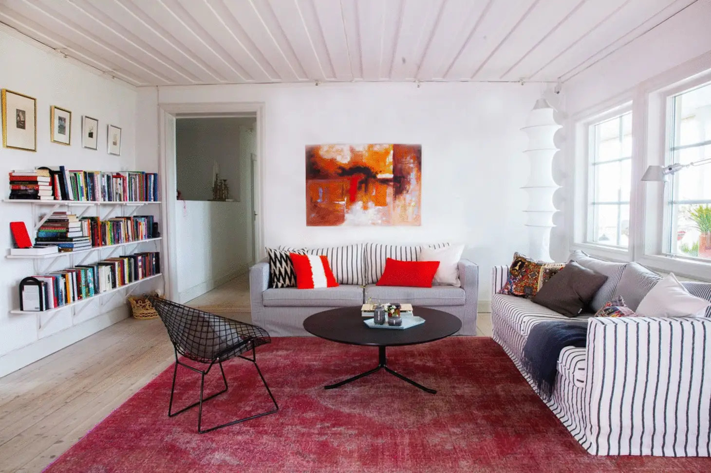   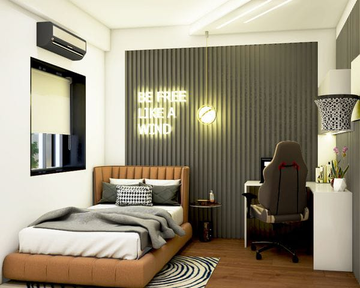
</section>
<section id="service">
    <h1 style="font-size: 80px; text-align: center;">What we Do ?</h1>
    <h2 style="margin-left: 20px; font-size: 50px;">Residential Interior :</h2>
    
We at Skye Blue Interior bring you a wide range of furniture amalgamating trends, comfort, aesthetics and goodness. 
    Our furniture defines the space and its purpose. We offer a broad range of furniture under different categories like modular kitchen, beds, workstations, wardrobes, TV cabinets, wall panelling, doors. Each category holds distinctive features and offers a comfortable, sophisticated and subtle decor that highlights the spaces more than objects.
    Grounded on the theme of neutrals and naturals our furniture provides exquisite ambiance along with maximum functionality and space optimisation.   

    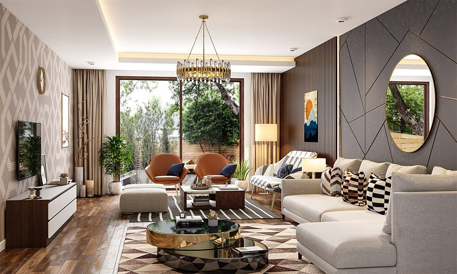
    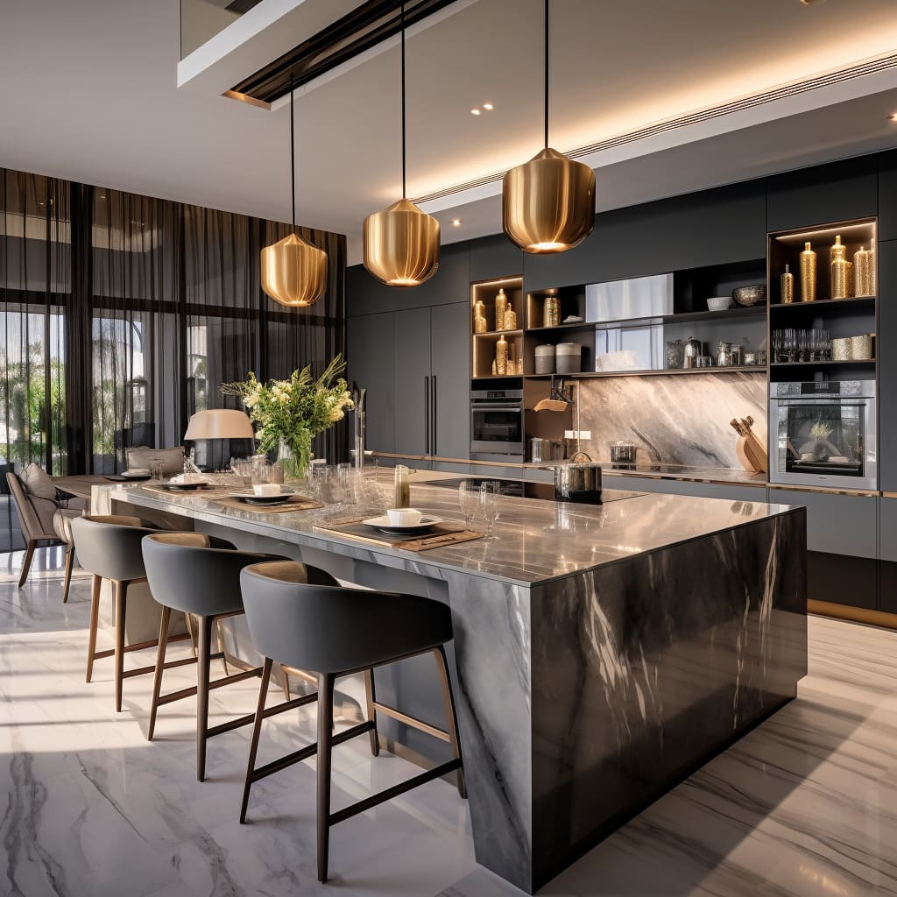
    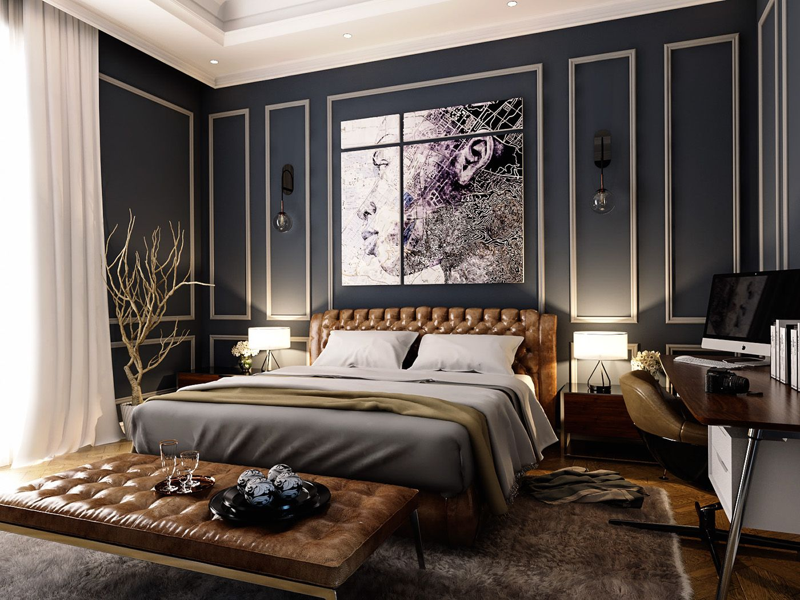  
    <h2 style="font-size: 50px; margin-left: 20px; margin-right: 20px;">Commerical Interiors:</h2>
    
We offer a wide range of office furniture ranging from office seating and storage systems to collaborative desking systems and workstations so as to fulfil the exact needs of the users ensuring hundred percent satisfaction. 
    The product offerings of Skye Blue Interiors clearly reflects its progressive designs in contemporary office furniture. Apart from designing & manufacturing the standard o ce furniture, our services also include designing as well as manufacturing of customised furniture so as to meet the unique and individualised requirements of our clients along with project management and installation. 
    This is exactly what makes us stand out from our competitors and lie among the top of the preference list of the clients.   

    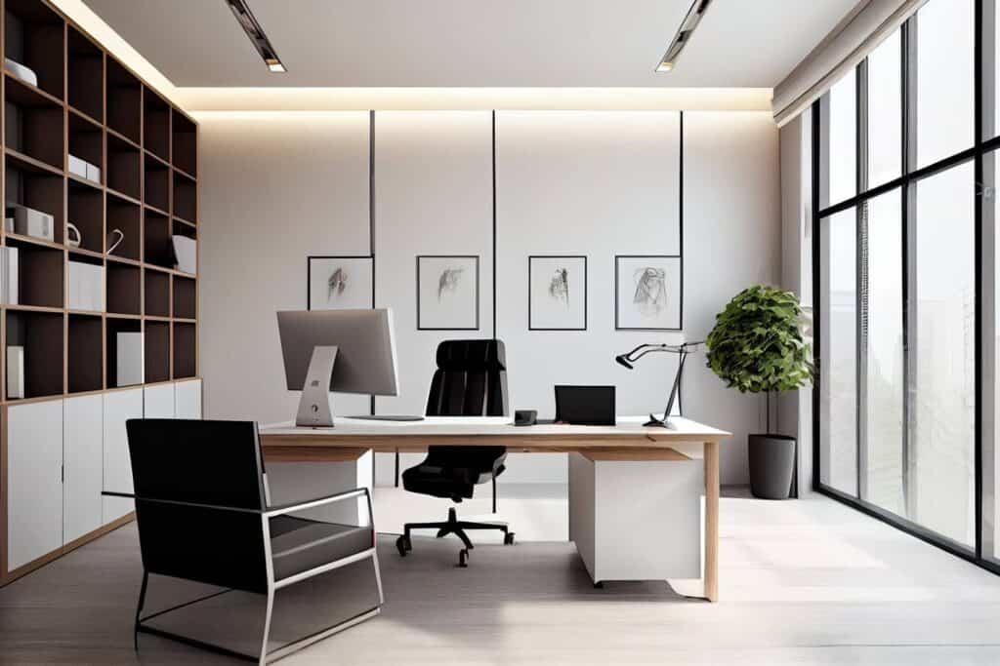
    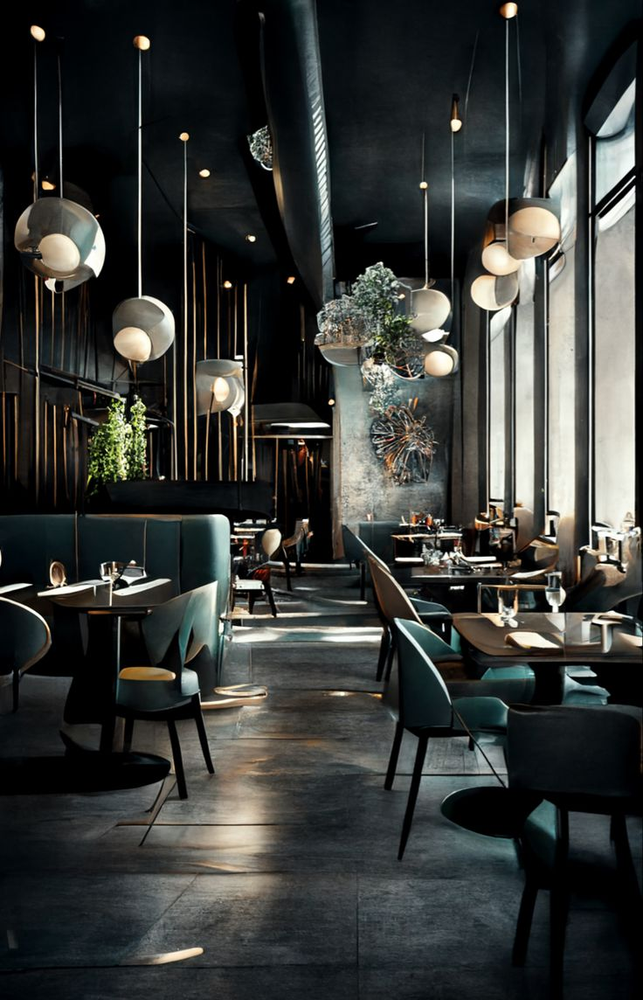
    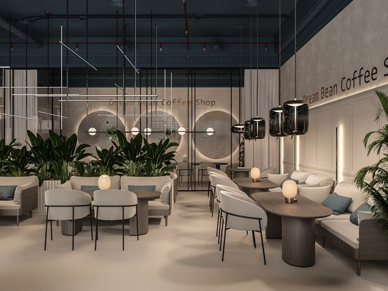    
    <h2 style="font-size: 50px;text-align: center;">Why Choose us ?</h2>
    
Skye Blue has a team of professionals who are adequately trained and vastly experienced so as to come  up with the desired results. 
    Skye Blue always focuses on client satisfaction, quality, reliability, and safety. We take pride in having the   manufacturing agility for necessarily responding to the evolving needs and expectations in the workplace. 
    Our expert team is  capable enough to handle even the toughest of tasks that too within a stipulated frame of time.     

    <video width="80%" height="600px" style="margin-left: 200px;" controls autoplay><source src="video.mp4" type="video/mp4"></video>   
</section>
<section id="contact">

<strong>Skye Blue Interior Design </strong> 
-Designing with passion, building with precision 

<b>
    Contact us</b>

    
Hyderabad 500001, Telangana, India. 
    contact: 9063551837  
    <b>--Navadeep Sai</b>

</section>
<footer style="background-color: black;">  
    
Copy right 2024 Skye Blue Interior    Powered by Skye Blue Interior Design   

    &nbsp;&nbsp;&nbsp;
    &nbsp;&nbsp;&nbsp;
    &nbsp;&nbsp;&nbsp;
      
</footer>

</body>
</html>
